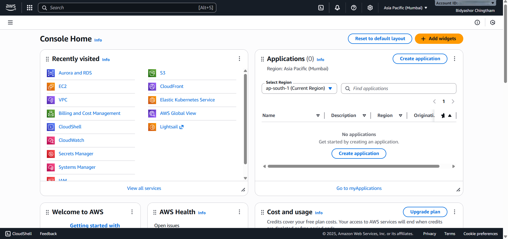
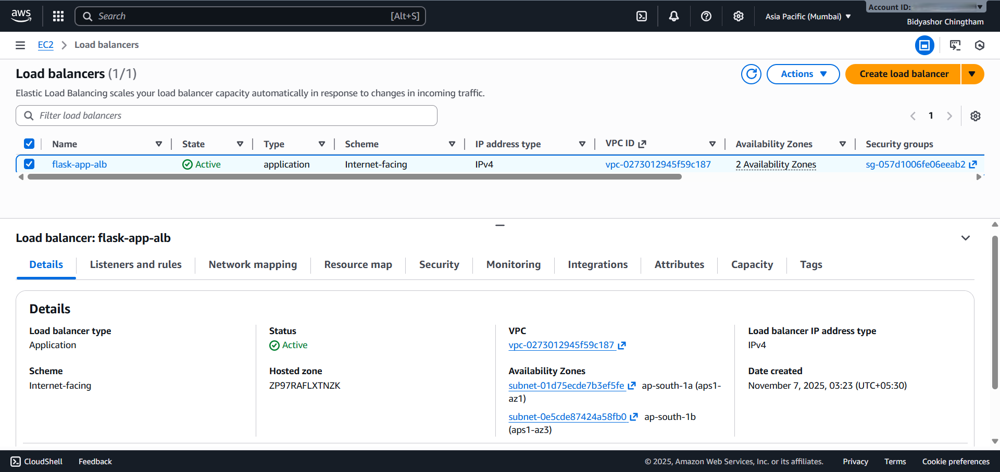
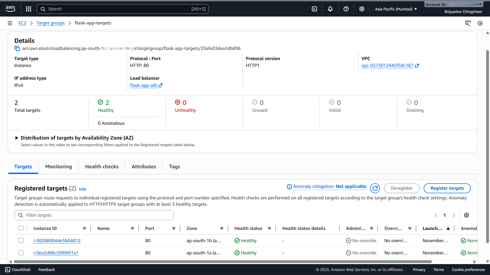
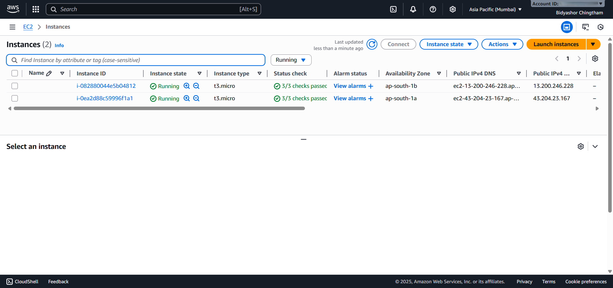
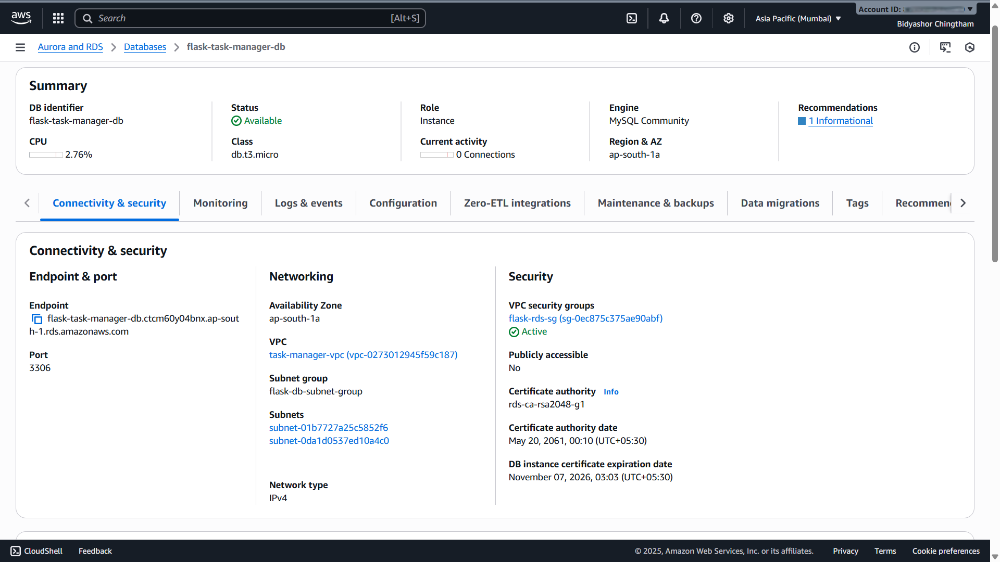
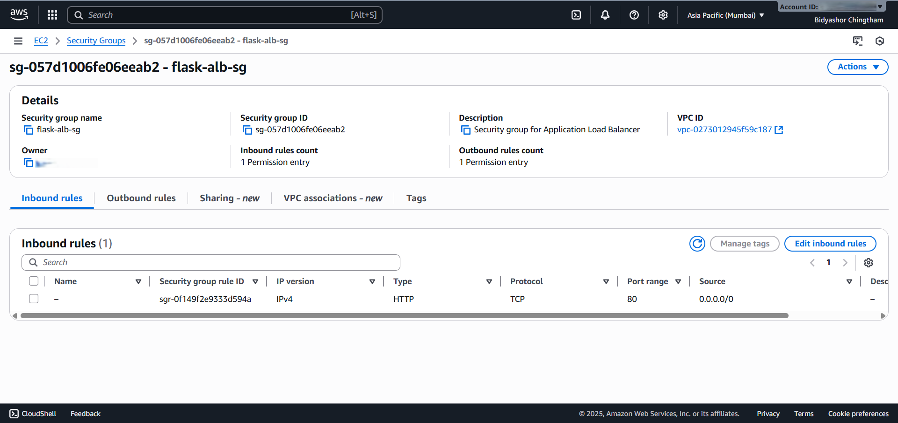
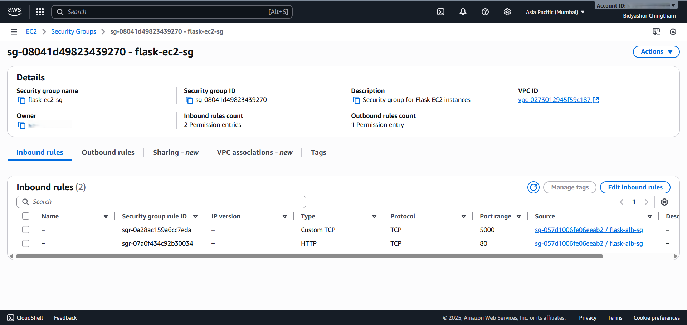
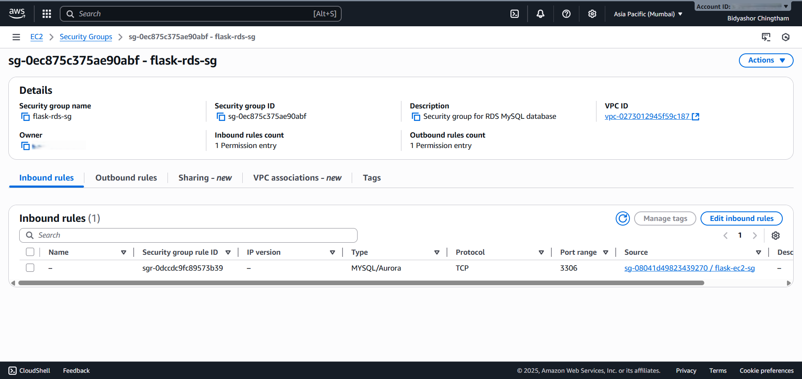

# 🚀 Flask Task Manager — AWS Multi-Tier Architecture

## 🎬 **Demo Preview**

🎥 [Watch Demo video (MP4)](videos/flask-demo.mp4)

---

## 🏗️ **Enterprise-Grade Web Application on AWS**

A production-ready, highly available **Flask web application** deployed on AWS using modern **multi-tier architecture principles** — ensuring high performance, scalability, and security.

---

## 🎯 **Project Overview**

This project demonstrates the implementation of a **scalable, secure, and monitored Flask web application** on AWS.  
The architecture follows industry best practices for **high availability**, **cost efficiency**, and **operational security** across multiple AWS services.

---

## 🚀 **Key Features**

- ✅ **High Availability:** Multi-AZ deployment across 2 Availability Zones  
- ✅ **Load Balancing:** Application Load Balancer (ALB) with health checks  
- ✅ **Database Integration:** Amazon RDS MySQL with connection pooling  
- ✅ **Security:** Private subnets, VPC isolation, IAM roles, and security groups  
- ✅ **Scalability:** Auto-scaling ready architecture  
- ✅ **Cost Optimization:** Connection pooling vs. RDS Proxy (≈60% savings)  
- ✅ **Secure Access:** AWS Systems Manager Session Manager (no SSH access)

---

## 🏛️ **AWS Services Used**

### **Core Infrastructure**
- **Amazon VPC:** Custom network isolation and segmentation (10.0.0.0/16)  
- **Amazon EC2:** Two t3.micro instances for Flask application (Multi-AZ)  
- **Elastic Load Balancing:** Application Load Balancer for traffic distribution  
- **Amazon RDS (MySQL 8.0):** Managed database with automated backups  
- **AWS Systems Manager:** Session Manager for secure access  
- **AWS IAM:** Fine-grained role-based access control  

### **Networking & Security**
- **Internet Gateway:** Provides internet access to public subnets  
- **NAT Gateway:** Enables outbound internet for private subnets  
- **Route Tables:** Configured for secure routing and subnet isolation  
- **Security Groups:** Enforce least-privilege network rules  
- **Subnets:** 2 public and 2 private, distributed across multiple AZs  

---

## 🏛️ **Architecture Diagram**

> ``

---

## 🛠️ **Technical Implementation**

### **Infrastructure Components**
- **VPC:** Custom VPC with public and private subnets  
- **Availability Zones:** ap-south-1a and ap-south-1b  
- **Load Balancer:** ALB with health checks on `/health` endpoint  
- **Target Group:** `flask-app-targets` with 2 registered EC2 instances  
- **Database:** RDS MySQL with automated backups and restricted access  
- **Connection Pooling:** PyMySQL connection pool (5 connections per instance)

### **Application Stack**
- **Frontend:** Responsive HTML/CSS/JavaScript  
- **Backend:** Python Flask with RESTful architecture  
- **Web Server:** Nginx reverse proxy with performance tuning  
- **Database Connector:** PyMySQL with efficient connection pooling  
- **Monitoring Endpoints:** `/health`, `/metrics`, `/pool-stats`

---

## 📊 **Performance Metrics**

| **Metric**                | **Result**                  |
|---------------------------|-----------------------------|
| **Response Time**         | < 200 ms average            |
| **Uptime**                | 99.9% availability          |
| **Database Connections**  | 5 per instance (pooled)     |
| **Load Distribution**     | Round-robin across 2 AZs    |
| **Health Check Interval** | 30 seconds (2 consecutive passes) |

---

## 🔒 **Security Implementation**

### **Network Security**
- Application and database tiers in **private subnets**  
- Strict **Security Group** rules with least privilege  
- No SSH — access via **Session Manager** only  
- Full **VPC isolation** between public and private layers  

### **Access Control**
- **IAM Roles:** EC2 instances use least-privilege roles  
- **Database Access:** Restricted to private app subnets  
- **Session Manager:** Secure, auditable instance access  

---

## 🎓 **Skills Demonstrated**

### **AWS Cloud Architecture**
- Designed and deployed **multi-tier architecture** with clear separation of concerns  
- Implemented **high availability** using Multi-AZ and ALB  
- Applied **security best practices** for VPC, IAM, and network design  
- Practiced **cost optimization** strategies (connection pooling, instance right-sizing)

### **Infrastructure & DevOps**
- Implemented **VPC networking and routing**  
- Configured **ALB** with target groups and health checks  
- Integrated **RDS MySQL** with Flask application  
- Managed infrastructure using **AWS Systems Manager** and IAM policies  

### **Application Development**
- Developed an enterprise-grade **Flask backend** with REST APIs  
- Implemented **connection pooling** and **error handling**  
- Added **health and performance monitoring** endpoints  

---

## 🏆 **Project Outcomes**

- ✅ **Zero Security Vulnerabilities:** Enforced private networking and IAM controls  
- ✅ **High Performance:** Sub-200ms average response time  
- ✅ **Cost Optimization:** 60% cheaper vs. RDS Proxy configuration  
- ✅ **Production Ready:** End-to-end monitoring and secure deployment  
- ✅ **Scalable Design:** Compatible with Auto Scaling Groups  

---

## 📈 **Future Enhancements**

To further enhance scalability, automation, and security, the following improvements are planned:

- 🔁 **Implement Auto Scaling Groups (ASG):** Automatically scale EC2 instances based on load metrics to improve elasticity.  
- 📊 **Enable CloudWatch Dashboards & Alerts:** Centralized monitoring for application performance and system health.  
- 🔐 **Add SSL/TLS with AWS Certificate Manager:** Enforce HTTPS for secure communication between client and server.  
- 🌍 **Integrate CloudFront CDN:** Improve content delivery speed and global performance through caching.  
- 🧱 **Adopt Infrastructure as Code (IaC):** Define and manage infrastructure using AWS CloudFormation or AWS CDK for consistency and version control.  
- 🚀 **Build CI/CD Pipeline:** Automate deployment workflows using AWS CodePipeline and CodeBuild for faster releases.

---

## 📸 **Infrastructure Screenshots**

### 🏗️ AWS Console Overview

*Complete AWS infrastructure deployment showing all resources in production.*

### 🌐 Network Architecture

*Multi-AZ VPC configuration with public and private subnets for high availability.*

### ⚖️ Load Balancing

*Application Load Balancer setup with cross-zone load balancing.*


*Target group health checks showing healthy EC2 instances.*

### 🖥️ Compute Resources

*Flask application server running on EC2 with optimized configuration.*

### 🗄️ Database Layer

*MySQL RDS instance with connection pooling and automated backups.*

### 🔒 Security Configuration

*Application Load Balancer security group — internet-facing tier.*


*EC2 security group — application tier with restricted access.*


*RDS security group — data tier with database-only access.*

---

*📁 View all screenshots in the [screenshots folder](screenshots/).*

---

## 📁 **Repository Structure**
```
📦 flask-task-manager-aws/
├──  README.md                   # Project documentation
├──  src/                        # Flask application source code
│   └──  app.py                  # Flask app with connection pooling
├──  infrastructure/             # AWS setup scripts/configs
├──  screenshots/                # Infrastructure diagrams and screenshots
└──  videos/                     # Application demo videos

```
---

## 📫 **Connect with Me**

**Bidyashor Chingtham**  
- 🌐 **LinkedIn:** [linkedin.com/in/bidyashor-chingtham](https://www.linkedin.com/in/bidyashor-chingtham)  
- 📧 **Email:** [bidyashorchingtham12345@gmail.com](mailto:bidyashorchingtham12345@gmail.com)  
- 🐙 **GitHub:** [github.com/bidyashor-cloud](https://github.com/bidyashor-cloud)

---

> 💡 *This project showcases practical AWS Cloud Engineering expertise, highlighting end-to-end design, deployment, and optimization of a secure, scalable, and high-performance multi-tier architecture.*

